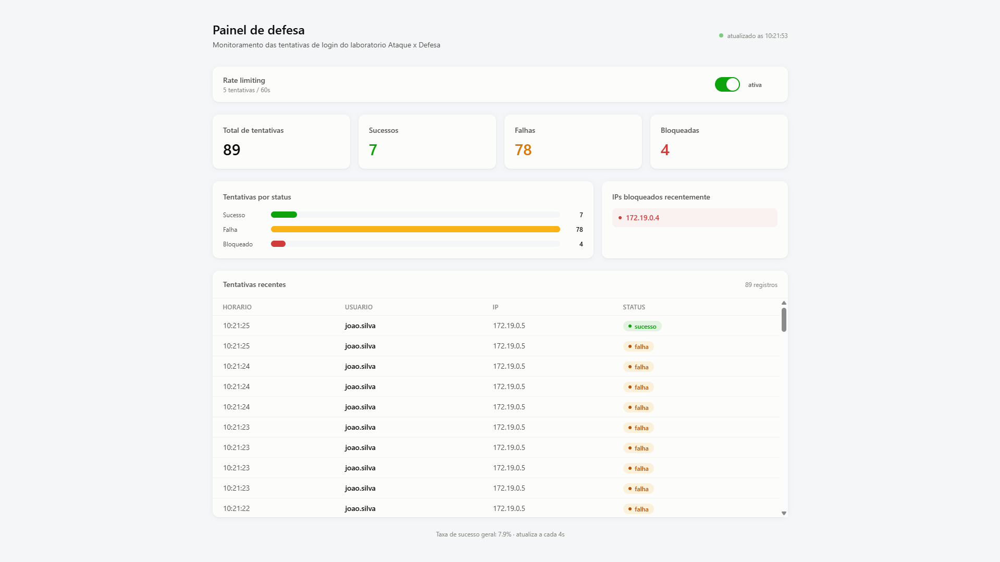
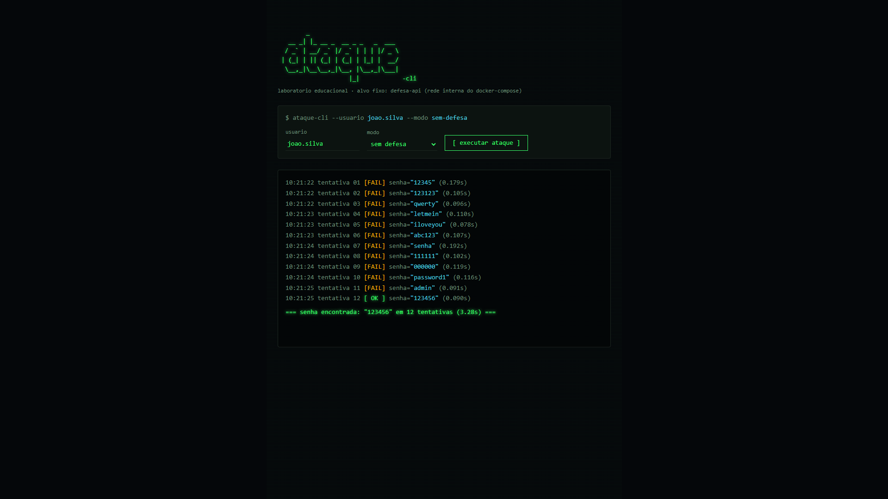

# Lab Ataque x Defesa

Laboratório educacional para uma disciplina de Python: um serviço de login em
Spring Boot (**defesa-api**) com hashing de senha, rate limiting e log de
tentativas, atacado por um script de força bruta em Python (**ataque-cli**),
com dashboards em Next.js para visualizar os dois lados (**defesa-web** e
**ataque-web**).

## Aviso de escopo (leia antes de rodar)

O script de ataque **só pode mirar o `defesa-api` dentro da rede interna do
docker-compose deste projeto** (`http://defesa-api:8080`, ou `localhost` /
`127.0.0.1` quando rodado fora do Docker). Isso é reforçado em código, não só
por convenção: `ataque-cli/seguranca.py` valida o host antes de qualquer
requisição e recusa qualquer alvo fora dessa lista — tanto no script CLI
quanto no servidor HTTP que atende o `ataque-web`. **Nunca** aponte estas
ferramentas para IPs ou domínios externos.

## Arquitetura

```
/lab-ataque-defesa
  /defesa-api    Spring Boot (Java 21) — login, cadastro, rate limiting, logs
  /defesa-web    Next.js — dashboard das tentativas de login (porta 3000)
  /ataque-cli    Python — script de ataque via CLI + servidor HTTP (porta 9000)
  /ataque-web    Next.js — console estilo terminal para disparar o ataque (porta 3001)
  /db/init.sql   schema + seed do Postgres
  docker-compose.yml
```

| Serviço      | Porta host | Descrição                                              |
|--------------|-----------|----------------------------------------------------------|
| `postgres`   | 5432      | Banco de dados, populado por `db/init.sql`                |
| `defesa-api` | 8080      | API de login/registro/logs/admin                          |
| `defesa-web` | 3000      | Dashboard de monitoramento                                 |
| `ataque-api` | 9000      | Servidor HTTP que executa ataques sob pedido do `ataque-web` |
| `ataque-web` | 3001      | Console "hacker" para disparar ataques com progresso ao vivo |

`ataque-cli` (o script de linha de comando, com relatório comparativo e
gráfico) roda sob demanda e não é um serviço permanente — ver abaixo.

## Screenshots

### defesa-web — Dashboard de Monitoramento (porta 3000)



### ataque-web — Console de Ataque (porta 3001)



## Rodando com Docker (recomendado)

Pré-requisito: Docker Desktop instalado e rodando.

```bash
cd lab-ataque-defesa
docker compose up -d --build
```

Isso sobe `postgres`, `defesa-api`, `defesa-web`, `ataque-api` e `ataque-web`.
Depois de alguns segundos (o Spring Boot leva um tempinho para iniciar):

- Dashboard de defesa: http://localhost:3000
- API de defesa: http://localhost:8080
- Console de ataque (web): http://localhost:3001
- Servidor de ataque (API): http://localhost:9000

Para derrubar tudo:

```bash
docker compose down
# ou, para tambem apagar os dados do Postgres:
docker compose down -v
```

### Disparando o ataque

**Opção 1 — pelo navegador (`ataque-web`):** abra http://localhost:3001,
escolha o usuário alvo e o modo (`sem defesa` / `com defesa ativa`) e clique
em "executar ataque". O progresso aparece em tempo quase real, tentativa por
tentativa.

**Opção 2 — pelo CLI, com relatório comparativo e gráfico:** o `ataque-cli`
fica atrás de um [profile](https://docs.docker.com/compose/how-tos/profiles/)
do compose para não subir sozinho com `docker compose up`:

```bash
docker compose --profile ataque run --rm ataque-cli \
  --usuario joao.silva --modo comparar
```

Isso roda os dois cenários (sem defesa / com defesa ativa) em sequência e
grava um relatório (`.txt`, `.json` e um gráfico `.png` comparando as
métricas) em `ataque-cli/relatorios/<timestamp>/`, visível direto no host
(a pasta é montada como volume).

Outras flags úteis do CLI:

```bash
docker compose --profile ataque run --rm ataque-cli --help
```

| Flag         | Default                                | Descrição                                   |
|--------------|-----------------------------------------|----------------------------------------------|
| `--usuario`  | `joao.silva`                            | usuário alvo (ver seed em `db/init.sql`)      |
| `--modo`     | `comparar`                              | `sem-defesa`, `com-defesa` ou `comparar`      |
| `--wordlist` | `wordlists/comuns.txt`                  | arquivo `.txt` com uma senha por linha        |
| `--delay`    | `0.1`                                   | segundos entre tentativas                     |
| `--host`     | `http://defesa-api:8080`                | alvo (validado contra a allowlist de segurança)|
| `--saida`    | `relatorios`                            | diretório onde salvar o relatório             |

## Rodando manualmente (sem Docker)

Útil para desenvolver/depurar um serviço isolado. Precisa de: **Java 21 +
Maven**, **Python 3.12+**, **Node.js 20+** e um **Postgres 16** acessível.

### 1. Banco de dados

Suba um Postgres local (ou use `docker run`) e rode o schema/seed:

```bash
docker run -d --name lab-postgres -p 5432:5432 \
  -e POSTGRES_DB=labdefesa -e POSTGRES_USER=labdefesa -e POSTGRES_PASSWORD=labdefesa \
  postgres:16-alpine

psql -h localhost -U labdefesa -d labdefesa -f db/init.sql
```

### 2. defesa-api (Spring Boot)

```bash
cd defesa-api
./mvnw spring-boot:run
```

Variáveis de ambiente (todas têm default, ver `application.properties`):
`DB_HOST`, `DB_PORT`, `DB_NAME`, `DB_USER`, `DB_PASSWORD`, `SERVER_PORT`,
`RATE_LIMIT_ENABLED`, `RATE_LIMIT_MAX_ATTEMPTS`, `RATE_LIMIT_WINDOW_SECONDS`.
Sobe em `http://localhost:8080`.

### 3. ataque-cli / ataque-api (Python)

```bash
cd ataque-cli
python -m venv .venv
source .venv/bin/activate   # Windows: .venv\Scripts\activate
pip install -r requirements.txt

# CLI (roda uma vez e sai):
python ataque.py --host http://localhost:8080 --usuario joao.silva --modo comparar

# ou o servidor HTTP usado pelo ataque-web:
python servidor.py   # sobe em http://localhost:9000, TARGET_API_URL default = http://defesa-api:8080
```

Fora do Docker, `TARGET_API_URL` deve apontar para `http://localhost:8080`
(defina a variável de ambiente antes de rodar `servidor.py`, ou passe
`--host http://localhost:8080` para o `ataque.py`) — `defesa-api` só existe
como hostname dentro da rede do compose.

### 4. defesa-web / ataque-web (Next.js)

```bash
cd defesa-web   # ou ataque-web
npm install
npm run dev
```

`defesa-web` sobe em `http://localhost:3000` e `ataque-web` em
`http://localhost:3000` também por padrão (rode com `npm run dev -- -p 3001`
se for levantar os dois ao mesmo tempo fora do Docker). Cada app lê a URL da
API correspondente de uma env var (`NEXT_PUBLIC_API_URL` /
`NEXT_PUBLIC_ATTACK_API_URL`, ver `.env.example` em cada pasta) — como são
`NEXT_PUBLIC_*`, precisam existir **antes do build** (`npm run build`) se
você não estiver usando `npm run dev`.

## Bibliotecas Python utilizadas

Tudo listado em `ataque-cli/requirements.txt`:

| Biblioteca  | Versão  | Para que serve                                                                 |
|-------------|---------|----------------------------------------------------------------------------------|
| `requests`  | 2.32.3  | cliente HTTP para as chamadas de login/admin contra o `defesa-api`                |
| `matplotlib`| 3.9.2   | gera o gráfico comparativo (`comparacao.png`) do relatório do CLI                 |
| `fastapi`   | 0.115.0 | framework do servidor HTTP (`servidor.py`) que atende o `ataque-web`              |
| `uvicorn`   | 0.30.6  | servidor ASGI que roda a aplicação FastAPI                                        |

Só a biblioteca padrão do Python é usada para o resto: `argparse` (CLI),
`dataclasses`/`enum` (modelos), `threading`/`uuid` (execuções em background no
servidor), `json`, `time`, `datetime`, `urllib.parse`.

## Estrutura de segurança (resumo)

- `ataque-cli/seguranca.py`: única fonte de verdade sobre quais hosts podem
  ser atacados (`defesa-api`, `localhost`, `127.0.0.1`). Usada tanto pelo
  `ataque.py` (CLI) quanto pelo `servidor.py` (API do `ataque-web`, que nem
  expõe um campo de host para o cliente — o alvo é sempre fixo).
- `defesa-api` nunca guarda senha em texto puro (BCrypt via
  `spring-boot-starter-security`).
- O rate limiting e o toggle de defesa (`/admin/defense`) existem justamente
  para o exercício de comparar "com" vs "sem" proteção — não são um recurso
  para desligar em produção.
